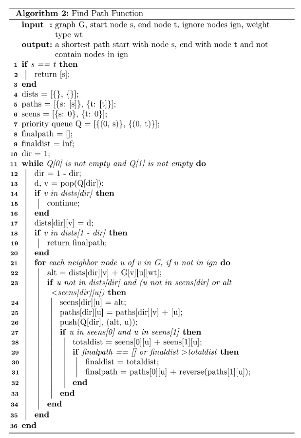
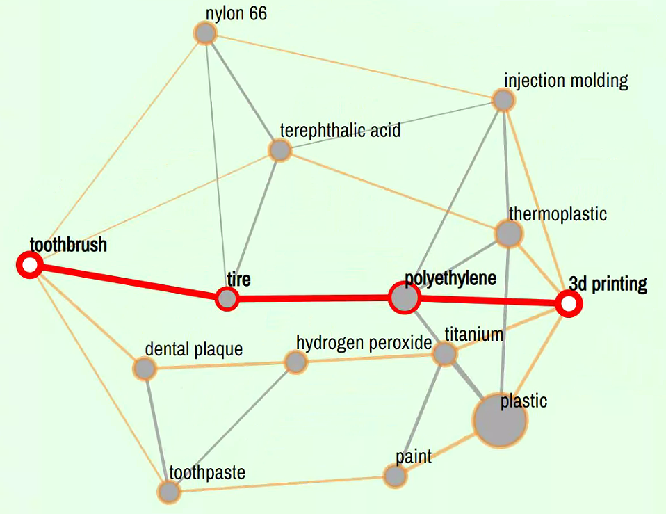
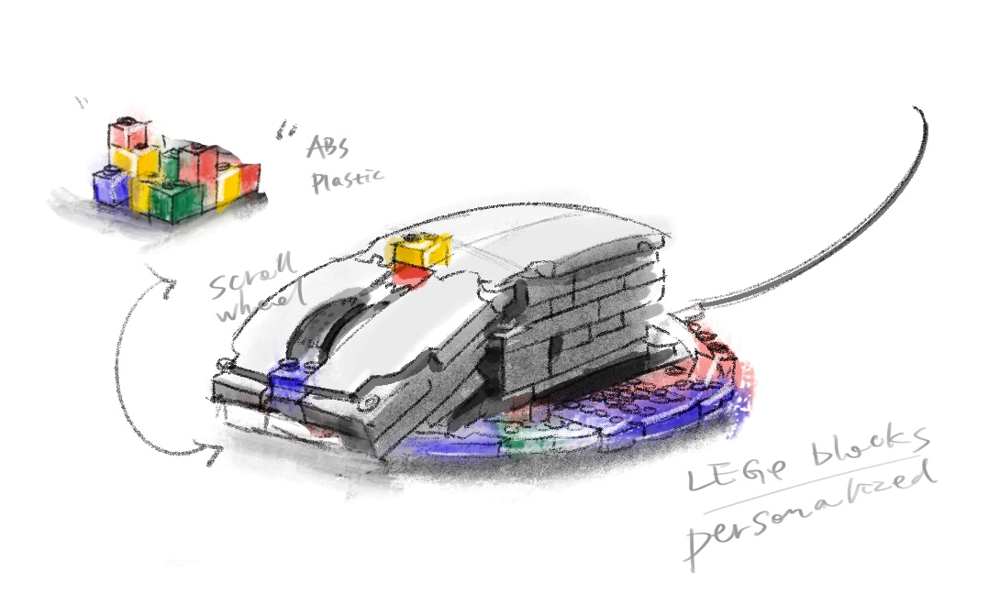
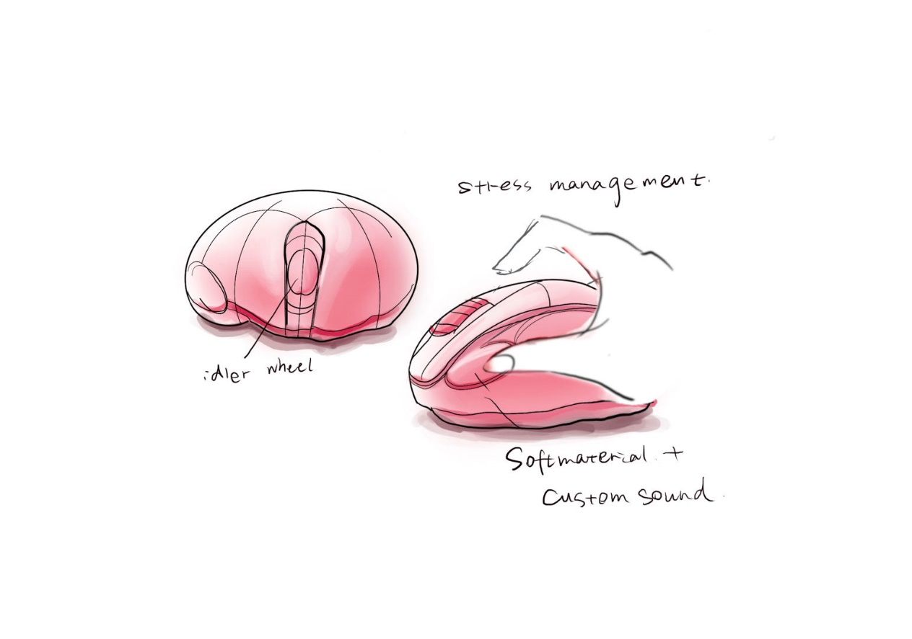

<h1 align="center">  <span style="color:blue">WikiLink Smart</span> </h1>

<h3 align="center">
    <p>WikiLink Smart</p>
</h3>

* WikiLink Smart is a semantic network for [combinatorial creativity](https://en.wikipedia.org/wiki/Computational_creativity). 
* It's constructed based on statistical weights using [Wikipedia data](https://dumps.wikimedia.org/) and semantic weights using [fastText](https://fasttext.cc/). It's further filtered using spaCy's[ en_core_web_trf](https://spacy.io/models/en#en_core_web_trf) model.
* For ideas diverge and converge, it supports neighborhood exploration and shortest path finding with node masking strategy.


* For idea generation, it further incorporates LLM to generate design ideas based on concept nodes chosen by users, following a "Base Concept + Additive Concept" - "Idea Explanation" - "Design Description" chain-of-thought few-shot prompting strategy.

### Examples
neighborhood exploration start with node "hair dryer":


shortest path finding between node "toothbrush" and "3d printing":



idea generation：

| Base Concept | Additive Concept | Explanation | Description |
| ------------ | ---------------- | ----------- | ----------- |
| Hair Dryer   | Zardozi          | Zardozi embroidery is a traditional form of Indian embroidery that involves the use of metallic threads, beads, and sequins to create intricate designs. The hair dryer can be designed with a similar aesthetic, using metallic accents and patterned designs to create a luxurious and elegant look. | The Zardozi Hair Dryer is a combination of modern technology and traditional embroidery techniques. The hair dryer features intricate zardozi embroidery, with metallic threads and sparkling beads adorning the body of the device. The hair dryer is lightweight, with multiple speed and temperature settings to suit all hair types. The Zardozi Hair Dryer is the perfect combination of functionality and style, adding a touch of luxury to your beauty routine. |
| Hair Dryer   | Tie-Dye          | Inspired by the vibrant and unique patterns created by tie-dye techniques, the hair dryer can be designed to have a colorful and artistic appearance. The colors and patterns can be applied to the body of the dryer, giving it a personalized touch for the user. | The Tye-Dye Salon Hair Dryer is a powerful and colorful addition to any salon or home styling station. The body of the dryer is treated with a unique tie-dye pattern, making it a one-of-a-kind accessory. The hair dryer has a high-velocity motor to quickly dry hair and comes with multiple heat and speed settings to cater to any hair type. The dryer also has a cool shot button to set the style in place. The handle is ergonomically designed for comfortable use, and the cord is extra-long for flexibility in styling positions. This hair dryer is not only a functional tool but also a stylish statement piece. |
| Hair Dryer   | Comb             | Inspired by the idea of combining two styling tools in one, a hair dryer with a built-in comb can be designed to simplify the hair drying and styling process. The comb attachment can help to detangle hair while the dryer blows air, making it easier to achieve a sleek, polished look. | This innovative hair dryer features a built-in comb attachment to provide effortless and efficient styling. The comb attachment is designed to detangle hair while the powerful dryer blows hot air, reducing the risk of damage from excessive heat. The hair dryer also features multiple heat and speed settings, allowing users to customize their styling experience for optimal results. The compact size and lightweight design make it easy to pack for travel or use on the go. |

sketches by designer after using WikiLink Smart to generate design ideas:
| Base Concept | Additive Concept | Explanation | Description |
| ------------ | ---------------- | ----------- | ----------- |
|computer mouse|lego|Lego blocks inspire creativity and customization. By combining the fun and playful aspect of Lego with the functionality of a computer mouse, the design can allow the user to create various designs and patterns on the surface of the mouse, making it a fun and personalized tool for work and play.|The Legomouse is a customizable computer mouse that can be assembled using Lego blocks. The mouse's base is designed to fit various Lego blocks, allowing the user to build and personalize different designs and shapes on the surface of the mouse. The Legomouse is ergonomically designed for comfort and precision, with two customizable buttons and a scroll wheel. It connects to the computer via USB port and is compatible with both Windows and Mac operating systems. The Legomouse is perfect for creative professionals, kids, and anyone who enjoys the fun and tactile experience of building with Lego.|
|computer mouse|stress management|Inspired by the need for stress relief during computer use, the mouse is designed with an integrated stress ball that can be squeezed or kneaded during breaks or moments of frustration, allowing the user to release tension and improve their overall productivity and well-being.|The Stress-Relieving Computer Mouse features an ergonomic design with a soft, squeezable stress ball integrated into the body of the mouse. The ball is made from a durable, non-toxic material and provides the user with a convenient outlet for stress relief during extended computer use. The mouse is compatible with both Windows and Mac operating systems, and its advanced optical sensor ensures smooth and accurate cursor control. Additionally, the Stress-Relieving Computer Mouse comes in a variety of colors and designs to suit any personal style.|




## Getting Started

### Installation
WikiLink Smart is developed and tested on Windows platform.

Package Requirements:

- Python >= 3.7
- OpenAI API key (We use gpt-3.5-turbo as default LLM backend)

Create conda environment:
```bash
conda create --name wikilink python=3.7
conda activate wikilink
```

Install dependencies:
```bash
pip install -r requirements.txt
```

To use gpt-3.5-turbo as LLM backend, make sure you have some funds (at least 3 dollars) in your OpenAI account and set your OpenAI API key:

- Windows:
```bash
set OPENAI_API_KEY=sk-xxxx
```

- MacOS:
```bash
export OPENAI_API_KEY=sk-xxxx
```

### Run code

Within the repo, run the following command in your terminal:

```bash
python server.py
```

This will start a new web page and you can explore WikiLink Smart in it.

### Code structure 
```
│   .gitattributes
│   .gitignore
│   app.asar
│   compare.txt
│   concept2design.py # LLM idea generation
│   fb-completion.html
│   feedback-2.html
│   index.html # main web page of WikiLink Smart
│   PF.py
│   README.md
│   requirements.txt
│   server.py # main server for web application
│   signup.html 
│
├───data # contains data of semantic network
│       test6_37_28_nominus_updated_cleannameplace2.gpickle
│       word2id_from_graph.json
│
├───networkanalysis
│   │   __init__.py
│   │
│   ├───Analysis
│   │       Retrievor.py
│   │       __init__.py
│   │
│   └───Process_OriginalTable
│           main.py
│           results.txt
│           test.py
│           test.txt
│           __init__.py
│
├───Private
│       functions.py
│       PF.py
│       PubFunctions.py
│       __init__.py
│
├───static    # contains static files (js, css, images)
│       ...
├───templates # html templates for collecting user feedback
│       ...
├───user_Feedback
│       ...
└───wiki_data_preprocessing
        layer_3_filter_all.py
        wiki_data_analysis.py
```

## Contact
If you have any questions or suggestions, feel free to open an issue or submit a pull request. We will provide timely feedback.

## Credits
This code is developed further on [WikiLink](https://github.com/zju-d3/WikiLink).

